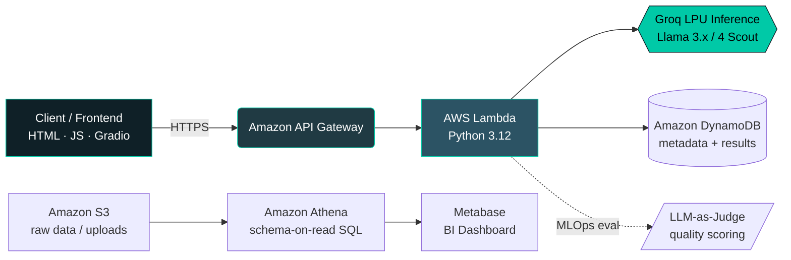

<div align="center">


<a href="https://www.linkedin.com/in/tanmay-hadke/">
  
</a>
<a href="https://github.com/Tanmay-Hadke">
  
</a>


<br/>

<a href="https://github.com/Tanmay-Hadke">
  
</a>

</div>

<br/>

## 🎯 About Me

I'm a Computer Science graduate (**9.84 CGPA**) currently pursuing a **Master's in Data Science**, and my work sits at the intersection of three things: **cloud-native architecture, applied ML/GenAI, and data engineering**. Rather than just training models in notebooks, I ship them — as serverless pipelines on AWS, agentic multi-step workflows, and retrieval systems wired up to real LLMs.

Most of my recent builds share the same DNA: **zero-server, scale-to-zero AWS backends** (Lambda + API Gateway + DynamoDB/S3/Athena) fronting fast open-weight LLM inference (Groq/Llama), with an MLOps layer for evaluation baked in rather than bolted on.

```yaml
role:         Aspiring Data Scientist & Cloud-Native ML Engineer
currently:    M.S. Data Science (in progress)
focus_areas:  [GenAI Systems, RAG, Agentic Pipelines, Serverless MLOps, Bioinformatics Data]
ask_me_about: [Predictive Modelling, LLM Orchestration, AWS Serverless, Vector Search, Statistics]
philosophy:   "Every model deserves a production home, not just a notebook."
```

<br/>

## 🏗️ How My Projects Are Wired Together

Almost every build below follows the same production pattern — decoupled storage, serverless compute, and an external LLM for inference:



<br/>

## 🚀 Featured Projects

<table>
<tr>
<td width="50%" valign="top">

### 👁️ [Multimodal Video RAG](https://github.com/Tanmay-Hadke/MultiModalVideoRag)
Search any video in **plain English** — *"show me a person falling"* returns the exact timestamp. No manual scrubbing, no labels.

`CLIP` `ChromaDB` `Groq Llama-4 Scout Vision` `Gradio`

**Pipeline:** frame sampling → CLIP embeddings → cosine search in ChromaDB → vision-LLM summary

</td>
<td width="50%" valign="top">

### 🧠 [GenAI Research Assistant](https://github.com/Tanmay-Hadke/genai-reseach-assistant)
Serverless app that ingests research PDFs and auto-summarizes them, with a continuous **LLM-as-a-Judge** evaluation loop.

`AWS Lambda` `API Gateway` `DynamoDB` `S3 Pre-signed URLs` `Groq Llama 3.3 70B`

**Result:** 100% structural compliance · 5.0/5.0 avg. quality score (automated eval)

</td>
</tr>
<tr>
<td width="50%" valign="top">

### 🧬 [BioML Course Generator](https://github.com/Tanmay-Hadke/aws-BioML-Course-Generator)
A 4-agent chained pipeline (Curriculum Architect → Professor → Lab Instructor → MLOps Validator) that generates and *validates* university-level bioinformatics curricula end to end.

`AWS Step Functions` `Lambda` `DynamoDB` `API Gateway`

</td>
<td width="50%" valign="top">

### 🚀 [Serverless Marketing Copy Generator](https://github.com/Tanmay-Hadke/Marketing-AI-App)
Turns a product description into platform-optimized ad copy (Twitter/LinkedIn/Instagram) with strict JSON-enforced LLM output — zero external Python dependencies.

`AWS Lambda` `API Gateway` `DynamoDB` `Groq Llama-3.1`

</td>
</tr>
<tr>
<td width="50%" valign="top">

### ☁️ [Bioinformatics Data Lake on AWS](https://github.com/Tanmay-Hadke/aws-bioinformatics-datalake)
A fully serverless, Free-Tier data lake for querying and visualizing gene-expression datasets straight off S3.

`Amazon S3` `Athena` `IAM` `Docker + Metabase` `SQL`

**Architecture:** Medallion-lite — S3 (storage) → Athena (schema-on-read SQL) → Metabase (BI)

</td>
<td width="50%" valign="top">

### 📚 Explore More
26 public repositories spanning ML/DL experiments, statistics, and dashboarding.

<a href="https://github.com/Tanmay-Hadke?tab=repositories">

</a>

</td>
</tr>
</table>

<br/>

## 🛠️ Tech Stack

<div align="center">

**Languages & Data**


**Cloud & Serverless (AWS)**


**AI / ML / GenAI**


**Tools & BI**


</div>

<br/>

## 📊 GitHub Analytics
 
<div align="center">


</div>
<div align="center">

</div>
<div align="center">

</div>
<br/>


## 📊 Certifications & Achievements

| Certification | Issuer |
|---|---|
| 🥇 SQL Gold Badge | HackerRank |
| 🥈 Python Silver Badge | HackerRank |
| [SQL Intermediate](https://www.hackerrank.com/certificates/70457cdc3b48) | HackerRank |
| [SQL Basics](https://www.hackerrank.com/certificates/8e23d79e8749) | HackerRank |
| [Python Basics](https://www.hackerrank.com/certificates/a55cbafd0b3e) | HackerRank |

<br/>

## 🔬 Research Contribution

**[Applications of Quantum Dots](https://www.ijset.in/wp-content/uploads/IJSET_V12_issue3_576.pdf)** — *International Journal of Scientific Engineering & Technology*

> Explores quantum dots (fluorescent nanocrystals) and their role in biomedical imaging, drug delivery, and quantum-dot display technology, with a focus on Graphene Quantum Dots (GQDs) as a carbon-based variant.

<br/>

<div align="center">

## 📫 Let's Connect

<a href="https://www.linkedin.com/in/tanmay-hadke/">
  
</a>

<br/><br/>


</div>
