 

 

 

## 🧑‍💻 About Me

Hey! I'm **Tanmay Hadke** — an AI/ML engineer and data professional based in **Pune, India**, open to hybrid/remote work. I specialize in end-to-end intelligent systems: from raw data pipelines to production-grade ML models.

My academic background is rooted in **Computer Science and Data Science**, but what drives me is the architecture *behind* the intelligence — orchestrating AWS Step Functions, optimizing Lambda pipelines, and structuring fast-retrieval data in DynamoDB. My focus is translating complex technical capability into fast, reliable systems that scale.

I live at the intersection of **Generative AI, agentic workflows, and robust cloud infrastructure** — believing the most impactful solutions emerge when rigorous research meets practical engineering. When I'm not training models or optimizing Spark jobs, I'm shipping side projects, learning new industry-required skills, or diving into the latest arXiv papers.

| 🚀 Projects | 📅 Experience | 🏆 Certifications |
|:---:|:---:|:---:|
| **14+** | **1+ yrs** | **5** |

 

## ⚙️ How I Operate

| Principle | What it means |
|---|---|
| **μ Experiment-first** | Every model ships with metrics attached — no vibes-based deployment |
| **σ Production-minded** | I care about latency, drift, and the 2am pager as much as accuracy |
| **ƒ(x) Explainable by default** | SHAP plots and plain-English writeups, not black boxes nobody can defend |
| **→ Fast iteration** | Notebook to endpoint in days — tight loops beat big-bang launches |
| **Δ Clear communication** | Stakeholders get plain numbers, not jargon dressed up as insight |
| **∞ Long-term thinking** | Models get monitored, retrained, and maintained — not abandoned post-launch |

 

## 🛠️ Tech Stack

**AI / Machine Learning**

**Data Engineering**

**Cloud & MLOps**

**Languages, Tools & Analytics**

**Databases & Vector Stores**

 

## 🧭 How I Build AI Systems

```mermaid
flowchart LR
    A["📥 Raw Data<br/>Docs · APIs · Sensors"] --> B["🧹 Preprocessing<br/>Cleaning and Feature Eng."]
    B --> C["🧠 Modeling Layer<br/>ML / LLM / RAG"]
    C --> D["🤖 Agent Orchestration<br/>Multi-Agent Pipelines"]
    D --> E["☁️ Cloud Deployment<br/>AWS / Serverless"]
    E --> F["📊 Insight and Product<br/>Dashboards · Apps"]

    style A fill:#0d1117,stroke:#00d4ff,color:#fff
    style B fill:#0d1117,stroke:#6e40c9,color:#fff
    style C fill:#0d1117,stroke:#00d4ff,color:#fff
    style D fill:#0d1117,stroke:#6e40c9,color:#fff
    style E fill:#0d1117,stroke:#00d4ff,color:#fff
    style F fill:#0d1117,stroke:#6e40c9,color:#fff
```

 

## 💼 Experience

### 🔹 AI Software Developer — Webworx India *(Full-Time)*
**July 2025 — Present**
- Engineered a serverless telemetry ingestion pipeline using **Amazon Kinesis** and **AWS Lambda** to process continuous, large-scale sensor data at 24/7 throughput — eliminating manual intervention and cutting ML deployment overhead by **35%**
- Productionized an edge-to-cloud predictive monitoring system using **PyTorch** on **AWS IoT Greengrass** and **SageMaker**, shifting from batch-hour latency to real-time inference and improving diagnostic accuracy by **20%**
- Developed and deployed ML models for real-time anomaly detection in IoT sensor streams, supporting proactive maintenance and reducing mean time to intervention
- Formalized an end-to-end ML accountability framework covering data pipelines, model versioning, and governance checkpoints — adopted cross-functionally and achieving full Responsible AI compliance
- Collaborated with cross-functional engineering and product teams to translate operational data into actionable insights

`Computer Vision` `YOLOv8` `Full-Stack AI`

### 🔹 AI Software Developer Intern — Webworx India
**January 2025 — June 2025**
- Researched and prototyped a computer vision pipeline for tracking horse eating patterns and daily activity via CCTV feeds
- Optimized animal pose-estimation models (**MMPose** / **DeepLabCut**) to handle equine physiological movement in varying lighting conditions
- Benchmarked multi-person and animal detection performance for accuracy in high-latency streaming environments
- Collaborated on bioinformatics data-mining strategies linking visual movement data to equine health metrics

`Pose Estimation` `OpenCV` `PyTorch` `Data Mining`

### 🔹 AI Research Intern — GMGC
**June 2024 — July 2024**
- Researched multiple papers on Geographical Indicators and helped improve decision-making by **20%** using responsive dashboards

`MS Excel` `Tableau` `Power BI`

 

## 📌 Featured Projects

| | Project | Description | Stack |
|:---:|---|---|---|
| 🧬 | **[BioML Course Generator](https://github.com/Tanmay-Hadke/aws-BioML-Course-Generator)** | Automated curriculum generator for Bioinformatics — dynamically structures a 15-lecture ML syllabus on AWS | `AWS` `ML` `Bioinformatics` |
| 🚢 | **[Supply Chain Risk Predictor](https://github.com/Tanmay-Hadke/supply-chain-risk-predictor)** | Predictive model forecasting supply chain disruptions from historical logistics data | `Python` `Neo4j` `Llama 3` `LangGraph` |
| 🎯 | **[AI Marketing Strategist](https://github.com/Tanmay-Hadke/Marketing-AI-App)** | LLM-driven app generating SEO copy, campaign strategy, and audience-tailored content | `LLMs` `Prompt Engineering` `Python` |
| ☁️ | **[GenAI AWS Pipeline Architect](https://github.com/Tanmay-Hadke/genai-aws-pipeline-architect)** | Cloud architecture for deploying and orchestrating GenAI workflows on AWS at enterprise scale | `AWS` `MLOps` `Generative AI` |
| 🤖 | **[Serverless AI Research Crew](https://github.com/Tanmay-Hadke/serverless-ai-research-crew)** | Multi-agent system that autonomously scrapes, analyzes, and synthesizes research reports | `AWS` `Serverless` `AI Agents` |
| 📑 | **[GenAI Research Assistant](https://github.com/Tanmay-Hadke/genai-reseach-assistant)** | RAG-powered tool that summarizes academic papers and answers queries from dense text | `LangChain` `RAG` `Streamlit` |
| 💧 | **[Bioinformatics Data Lake](https://github.com/Tanmay-Hadke/aws-bioinformatics-datalake)** | Serverless AWS data lake to ingest, transform, and query massive genomic datasets | `AWS` `Athena` `Docker` |
| 🗄️ | **[Hybrid SQL RAG Agent](https://huggingface.co/spaces/tanmay2604/hybrid-sql-rag-agent)** ↗ | Agent that queries both SQL databases and unstructured document stores via hybrid RAG | `LangChain` `SQL` `LLMs` |
| 🧢 | **[GenZ ToS Translator](https://huggingface.co/spaces/tanmay2604/genz-tos-translator)** ↗ | NLP app that translates dense Terms of Service documents into Gen-Z slang | `HuggingFace` `LLMs` `Gradio` |
| 🦆 | **[AI Rubber Duck Debugger](https://huggingface.co/spaces/tanmay2604/ai-rubber-duck-debugger)** ↗ | Conversational agent that helps developers talk through logic errors and tricky bugs | `HuggingFace` `Prompt Engineering` `LLMs` |
| 🎞️ | **[Multi-Modal Video RAG](https://github.com/Tanmay-Hadke/MultiModalVideoRag)** | RAG system indexing video across visual and audio modalities for natural-language search | `Multi-Modal LLMs` `Vector DB` `CV` |
| 🎓 | **[Socratic ML Tutor](https://huggingface.co/spaces/tanmay2604/socratic-ml-tutor)** ↗ | Educational AI that teaches ML concepts through guided Socratic questioning | `HuggingFace` `LLMs` `Gradio` |
| 🎨 | **[Mythology Comic Generator](https://github.com/Tanmay-Hadke/mythology-comic-generator)** | Pipeline transforming folklore into visually consistent comic panels via LLMs + diffusion | `Diffusion` `LLMs` `Python` |
| 👤 | **[Real-Time Age & Gender Detection](https://github.com/Tanmay-Hadke/Age-and-Gender-Detection)** · [Paper](http://doi.org/10.61463/ijset.vol.13.issue1.128) | CV app predicting demographic attributes from live video feeds | `OpenCV` `Deep Learning` `Python` |
| 🖐️ | **[Gesture Control System](https://github.com/Tanmay-Hadke/Gesture-Control)** | Real-time CV app translating hand movements into touchless system commands | `OpenCV` `MediaPipe` `Python` |
| 🖼️ | **[Neural Style Transfer](https://github.com/Tanmay-Hadke/Neural-Style-Transfer)** | Deep learning model blending artistic style and content using VGG19 | `Python` `CNNs` `Computer Vision` |

*Explore the full [repository list](https://github.com/Tanmay-Hadke?tab=repositories) or see everything live on my [portfolio](https://tanmay-hadke.github.io/portfolio/#projects).*

 

## 🏆 Achievements & Recognition

| Year | Achievement |
|:---:|---|
| 2024 | 🏆 **OCI Certified GenAI Professional** — Oracle Cloud Infrastructure certification covering LLMs, Prompt Engineering, RAG, LangChain |
| 2025 | 📝 **UGC NET Qualified** — Computer Science and Applications discipline |
| 2024 | 📜 **HackerRank SQL Certified** — Gold Badge honour |
| 2024 | ⭐ **HackerRank Python Certified** — Silver Badge honour |
| 2025 | 🎓 **Certified Resource Person** — DES Pune University, Data Visualization workshop for Bioinformatics, Dept. of Life Sciences |

 

## 📊 GitHub Stats

 

## 🤝 Let's Build Something

Open to **AI Engineering, ML Platform, Data Engineering, and Research** roles. Based in Pune — open to remote.

*"⚡ Fun fact: this profile was refined with a Gryffindor's attention to detail."*

