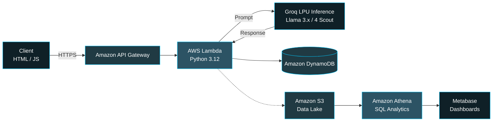

 

---

### 👋 About Me

I'm a Computer Science graduate (**9.84 CGPA**) currently pursuing a **Master's in Data Science**, and my work has evolved from classical ML/statistics into **applied Generative AI and serverless cloud engineering**. Most of what I ship follows the same philosophy: *scale-to-zero infrastructure, LLM inference where it earns its keep, and pipelines that don't fall over the moment traffic shows up.*

- 🧠 **Currently building:** multi-agent LLM pipelines, RAG systems, and event-driven AWS architectures
- ☁️ **Comfort zone:** AWS Lambda, API Gateway, DynamoDB, S3, Step Functions, Athena
- 🤖 **AI stack:** Groq (Llama 3.x / 4 Scout), CLIP embeddings, ChromaDB, LLM-as-a-Judge evaluation
- 📊 **Foundations:** predictive modelling, statistical analysis, regression/classification/clustering
- 🌱 **Always exploring:** MLOps validation patterns, vector search, and cost-efficient inference design

---

### 🧩 A Pattern in My Work

Looking across my recent projects, a common serverless blueprint keeps showing up — I design most GenAI apps around the same lean, event-driven backbone:

**Zero idle cost. Zero server management. Pay only when it's actually being used.**

---

### 🚀 Featured Projects

<table>
<tr>
<td width="50%" valign="top">

**👁️ [Multimodal Video RAG](https://github.com/Tanmay-Hadke/MultiModalVideoRag)**
Search any video with plain English — *"show me a person falling"* — and get back the exact timestamp. Frame sampling → CLIP embeddings → ChromaDB cosine search → Groq Vision auto-summary, wrapped in a Gradio UI.

`Python` `CLIP` `ChromaDB` `Groq Llama-4 Scout` `Gradio`

</td>
<td width="50%" valign="top">

**🧬 [BioML Course Generator](https://github.com/Tanmay-Hadke/aws-BioML-Course-Generator)**
A 4-agent chained workflow orchestrated by AWS Step Functions that architects a syllabus, writes lecture notes, generates working code, and validates it before persisting to DynamoDB — a small MLOps pipeline for AI-generated curricula.

`AWS Step Functions` `Lambda` `DynamoDB` `API Gateway`

</td>
</tr>
<tr>
<td width="50%" valign="top">

**📄 [GenAI Research Assistant](https://github.com/Tanmay-Hadke/genai-reseach-assistant)**
Serverless research-paper summarizer with pre-signed S3 uploads (bypassing API Gateway's 10MB cap) and an automated **LLM-as-a-Judge** evaluation loop — currently holding a 5.0/5.0 quality baseline with 100% output-format compliance.

`AWS Lambda` `DynamoDB` `Groq Llama 3.3 70B` `MLOps`

</td>
<td width="50%" valign="top">

**📢 [Marketing AI App](https://github.com/Tanmay-Hadke/Marketing-AI-App)**
Turns a product description into platform-tuned ad copy (Twitter/LinkedIn/Instagram) via JSON-enforced LLM output — dependency-free Python backend, scale-to-zero by design.

`Lambda` `API Gateway` `DynamoDB` `Groq Llama-3.1`

</td>
</tr>
<tr>
<td colspan="2" valign="top">

**☁️ [Serverless Bioinformatics Data Lake](https://github.com/Tanmay-Hadke/aws-bioinformatics-datalake)**
A Medallion-lite data lake for gene-expression data: S3 for storage, Athena for schema-on-read SQL, IAM for least-privilege access, and Metabase (Docker) for visualization — decoupling storage from compute end to end.

`Amazon S3` `Amazon Athena` `AWS IAM` `Docker` `Metabase` `SQL`

</td>
</tr>
</table>

📌 Pinned repos shown above — <a href="https://github.com/Tanmay-Hadke?tab=repositories">explore all repositories →</a>

---

### 🛠️ Tech Stack

**Languages & Data**
 

**Cloud & Infrastructure (AWS)**
 

**AI / GenAI / ML**
 

**BI, Tools & DevOps**
 

---

### 📊 GitHub Analytics

---

### 🏆 Certifications & Achievements

- 🐍 [Python Basics](https://www.hackerrank.com/certificates/a55cbafd0b3e) — HackerRank
- 🗄️ [SQL Basics](https://www.hackerrank.com/certificates/8e23d79e8749) · [SQL Intermediate](https://www.hackerrank.com/certificates/70457cdc3b48) — HackerRank
- 🥇 **SQL Gold Badge** on HackerRank
- 🥈 **Python Silver Badge** on HackerRank

### 📝 Research Contribution

**[Applications of Quantum Dots](https://www.ijset.in/wp-content/uploads/IJSET_V12_issue3_576.pdf)** — a published study on fluorescent nanocrystals, covering their role in bio-medical imaging, drug delivery, and semiconductor optics, with a focus on Graphene Quantum Dots (GQDs).

---

### 📫 Let's Connect

 

