<div align="center">


<a href="https://www.linkedin.com/in/tanmay-hadke/">
  
</a>
<a href="https://github.com/Tanmay-Hadke">
  
</a>
<br/>


<br/><br/>


</div>

<br/>


## 🧬 About Me

```yaml
tanmay_hadke:
  role: "Aspiring Data Scientist & GenAI Engineer"
  education:
    bachelor: "B.Sc. Computer Science — CGPA: 9.84 / 10"
    pursuing: "M.S. in Data Science"
  focus:
    - Predictive Modelling & Statistical Analysis
    - Machine Learning / Deep Learning (ANN, RNN)
    - Generative AI · Retrieval-Augmented Generation · LLM Agents
    - Cloud-Native, Serverless MLOps on AWS
  currently_exploring: "Multi-agent orchestration & production-grade LLMOps"
  ask_me_about:
    - "Predictive Modelling · Optimization · Dashboards"
    - "Serverless AWS architectures (Lambda, Athena, Step Functions)"
    - "RAG pipelines & vector search"
```

I began my data journey chasing a simple question: *how do you turn noisy, messy data into a decision someone can trust?* That curiosity has since pulled me from classical statistics and predictive modelling into building full-stack, serverless GenAI systems — where I now spend most of my time designing pipelines that ingest data, reason over it with LLMs, and ship insights end-to-end on the cloud.

<br/>

## 🗺️ How I Build — Data → Decision Pipeline

```mermaid
%%{init: {'theme': 'dark', 'themeVariables': { 'primaryColor': '#302b63', 'primaryTextColor': '#E0E0FF', 'primaryBorderColor': '#A996FF', 'lineColor': '#A996FF', 'secondaryColor': '#0f0c29', 'tertiaryColor': '#1a1a2e'}}}%%
flowchart LR
    A["📥 Ingest\nRaw Data / PDFs / Video"] --> B["🧹 Clean & Transform\nPython · SQL · Pandas"]
    B --> C["🧠 Model\nML/DL · Embeddings · LLMs"]
    C --> D["⚙️ Orchestrate\nAWS Lambda · Step Functions"]
    D --> E["📦 Store & Serve\nDynamoDB · S3 · Athena"]
    E --> F["📊 Visualize / Act\nDashboards · APIs · Agents"]
    F -.feedback loop.-> A

    style A fill:#1a1a2e,stroke:#A996FF,stroke-width:2px,color:#E0E0FF
    style B fill:#1a1a2e,stroke:#A996FF,stroke-width:2px,color:#E0E0FF
    style C fill:#302b63,stroke:#FF6EC7,stroke-width:2px,color:#E0E0FF
    style D fill:#1a1a2e,stroke:#A996FF,stroke-width:2px,color:#E0E0FF
    style E fill:#1a1a2e,stroke:#A996FF,stroke-width:2px,color:#E0E0FF
    style F fill:#302b63,stroke:#00E5FF,stroke-width:2px,color:#E0E0FF
```



<br/>

## 🛠️ Tech Stack

<div align="center">

**Languages & Core**


**Machine Learning / Deep Learning**


**Generative AI / LLMs**


**Cloud & MLOps**


**Analytics & BI**


**Tools**


</div>

<br/>

## 🚀 Featured Projects

<table>
<tr>
<td width="50%" valign="top">

### 🧬 [Serverless Bioinformatics Data Lake](https://github.com/Tanmay-Hadke/aws-bioinformatics-datalake)

A fully serverless data engineering pipeline on AWS Free Tier to store, query, and visualize gene expression datasets using a Medallion-lite architecture.

`S3` `Athena` `IAM` `Docker` `Metabase` `SQL`

</td>
<td width="50%" valign="top">

### 🧬 BioML — Multi-Agent Course Generator

A cloud-native MLOps pipeline where **4 chained AI agents** (Curriculum Architect → Professor → Lab Instructor → Validator) collaboratively generate university-level bioinformatics curricula.

`AWS Step Functions` `Lambda` `DynamoDB` `API Gateway`

</td>
</tr>
<tr>
<td width="50%" valign="top">

### 📄 [GenAI Research Assistant](https://github.com/Tanmay-Hadke/genai-reseach-assistant)

Event-driven, serverless app that ingests research PDFs and summarizes them via Llama-3.3-70B, with an automated "LLM-as-a-Judge" evaluation loop scoring **5.0/5.0** on quality.

`Lambda` `API Gateway` `DynamoDB` `Groq API` `Pre-signed S3 URLs`

</td>
<td width="50%" valign="top">

### 📣 Serverless GenAI Marketing Copy Generator

Generates platform-optimized marketing copy (Twitter, LinkedIn, Instagram) from a product description using Llama-3.1, built on a zero-cost, scale-to-zero AWS stack.

`Lambda` `API Gateway` `DynamoDB` `Groq (Llama-3.1)`

</td>
</tr>
<tr>
<td width="50%" valign="top">

### 🎥 Multimodal Video RAG — Temporal AI Search

Search any video with plain English (*"show me a person falling"*) and get the exact timestamp. Combines CLIP embeddings, ChromaDB vector search, and vision-LLM summarization.

`CLIP` `ChromaDB` `Groq Llama-4 Scout Vision` `Gradio`

</td>
<td width="50%" valign="top">

### 🔬 Research: Applications of Quantum Dots

Published research on graphene/carbon-based quantum dots — their role in drug delivery, cellular imaging, and quantum-dot display technology.

📄 [Read the paper](https://www.ijset.in/wp-content/uploads/IJSET_V12_issue3_576.pdf)

</td>
</tr>
</table>

<br/>

## 📊 Certifications & Achievements

<div align="center">

| Certification | Issuer |
|---|---|
| 🥇 SQL Gold Badge | HackerRank |
| 🥈 Python Silver Badge | HackerRank |
| [SQL Intermediate](https://www.hackerrank.com/certificates/70457cdc3b48) | HackerRank |
| [SQL Basics](https://www.hackerrank.com/certificates/8e23d79e8749) | HackerRank |
| [Python Basics](https://www.hackerrank.com/certificates/a55cbafd0b3e) | HackerRank |

</div>

<br/>

## 📈 GitHub Analytics

<div align="center">


</div>

<br/>

## 🤝 Let's Connect

<div align="center">

I'm always open to conversations about data science, GenAI systems, and cloud-native ML — feel free to reach out.

<a href="https://www.linkedin.com/in/tanmay-hadke/">
  
</a>

<br/><br/>


*"In God we trust. All others must bring data."* — W. Edwards Deming

</div>
